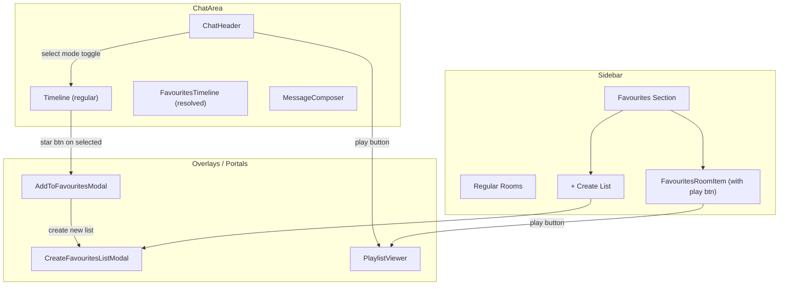

# Favourites Lists and Playlist Feature

## Data Model

- A **favourites list** is a regular Matrix room whose name starts with `Favourites:` .
- Each **favourite entry** is an `m.room.message` sent to that room, with body containing a `https://matrix.to/#/!roomId:server/$eventId` link.
- Detection: `room.name.startsWith("Favourites: ")`.
- Room creation: `client.createRoom({ name: "Favourites: <Name>", visibility: "private", preset: "private_chat" })` with no invites (just the user).

## Architecture Overview




---

## 1. Favourites Detection Hook

**New file:** `src/hooks/useFavourites.ts`

- Derives from `client.getRooms()` and `roomListVersion` (same reactivity as `useRoomList`).
- Returns `{ favouriteRooms: Room[], regularRooms: Room[], isFavouritesRoom: (roomId) => boolean, createFavouritesList: (name) => Promise<string> }`.
- `createFavouritesList` calls `client.createRoom(...)` with the naming convention.
- `isFavouritesRoom` checks `room.name.startsWith("Favourites: ")`.

---

## 2. Sidebar Updates

**Modified:** [src/components/Sidebar.tsx](src/components/Sidebar.tsx)

- Use `useFavourites()` to get `favouriteRooms` and `regularRooms`.
- Render two sections:
  - **"Favourites"** header with a `+` button (opens `CreateFavouritesListModal`). Each room item has a small play button to its right.
  - **"Rooms"** header with the existing room list (minus favourites rooms).
- The search filter applies to both sections.
- Play button on each favourites room entry calls `openPlaylist(roomId)` from `MatrixContext`.

---

## 3. Create Favourites List Modal

**New file:** `src/components/CreateFavouritesListModal.tsx`

- Portal-based modal (consistent with existing modals like `MessageEditHistoryModal`).
- Simple form: text input for the list name, Create and Cancel buttons.
- Calls `createFavouritesList(name)` from `useFavourites`.
- Used from both the sidebar `+` button and inline within `AddToFavouritesModal`.

---

## 4. ChatArea Changes

**Modified:** [src/components/ChatArea.tsx](src/components/ChatArea.tsx)

- Import `useFavourites` to check `isFavouritesRoom(currentRoomId)`.
- If favourites room: render `FavouritesTimeline` instead of `Timeline`, and hide `MessageComposer`.
- Lift **select mode state** here: `selectMode: boolean`, `selectedEventIds: Set<string>`. Pass down to `ChatHeader`, `Timeline`, and `Message` via props.
- Pass `isFavouritesRoom` flag to `ChatHeader` for conditional buttons.

---

## 5. Favourites Timeline (Resolved Rendering)

**New file:** `src/components/FavouritesTimeline.tsx`

- Similar structure to [src/components/Timeline.tsx](src/components/Timeline.tsx) (scroll container, date separators, pagination).
- For each message in the favourites room:
  1. Parse body with `parseMatrixToUrl()` from [src/lib/helpers.ts](src/lib/helpers.ts) to extract `{ roomId, eventId }`.
  2. **Resolve the referenced event:**
    - Try `client.getRoom(roomId)?.findEventById(eventId)` (local, handles decrypted events).
    - Fallback: `client.fetchRoomEvent(roomId, eventId)` then wrap in `new MatrixEvent(rawData)`.
    - Cache resolved events in a `Map<string, MatrixEvent>` via `useRef`.
  3. Render the resolved `MatrixEvent` using the existing `<Message>` component.
  4. If resolution fails (encrypted/missing): show a fallback pill with the matrix.to link.

---

## 6. ChatHeader Updates

**Modified:** [src/components/ChatHeader.tsx](src/components/ChatHeader.tsx)

Currently minimal (hamburger + room name). Add:

- **For regular rooms:** a "Select" button (e.g. `CheckSquare` icon from lucide) floating right. When active, shows a star button to the left of it.
- **For favourites rooms:** a "Play" button (`Play` icon) that calls `openPlaylist(currentRoomId)`.
- Toggling select mode on/off. When active and messages are selected, the star button opens `AddToFavouritesModal`.

---

## 7. Select Mode in Timeline and Message

**Modified:** [src/components/Timeline.tsx](src/components/Timeline.tsx), [src/components/Message.tsx](src/components/Message.tsx)

- `Timeline` receives `selectMode`, `selectedEventIds`, `toggleEventSelection` props.
- `Message` receives `selectMode`, `isSelected`, `onToggleSelect` props.
- When `selectMode` is on, each `Message` renders a checkbox (or tappable selection indicator) on its left edge.
- Clicking the message bubble or checkbox toggles selection.
- Selected messages get a subtle highlight (e.g. `ring-2 ring-accent/40`).

---

## 8. Add to Favourites Modal

**New file:** `src/components/AddToFavouritesModal.tsx`

- Portal-based modal, receives `selectedEventIds: Set<string>`, `sourceRoomId: string`, `onClose`.
- Lists all favourites rooms (from `useFavourites`), each with a checkbox.
- Has a "Create new list" button at the bottom (opens `CreateFavouritesListModal` inline or nested).
- **Submit:** for each selected favourites room and each selected event ID, sends a message:

```
  client.sendEvent(favRoomId, EventType.RoomMessage, {
    msgtype: MsgType.Text,
    body: `https://matrix.to/#/${encodeURIComponent(sourceRoomId)}/${encodeURIComponent(eventId)}`
  })
  

```

- Shows progress/toast, then closes and exits select mode.

---

## 9. Playlist Settings

**Modified:** [src/contexts/SettingsContext.tsx](src/contexts/SettingsContext.tsx)

Add three new settings (persisted to localStorage):

- `playlistImageDuration: number` (default: 5 seconds)
- `playlistShowMessages: boolean` (default: true)
- `playlistMessageDuration: number` (default: 5 seconds)

With setters: `setPlaylistImageDuration`, `togglePlaylistShowMessages`, `setPlaylistMessageDuration`.

**Modified:** [src/components/SettingsModal.tsx](src/components/SettingsModal.tsx)

Add a new **"Playlist"** section after the "Messages" section with:

- Numeric input for image display duration (seconds).
- Toggle for whether text messages display in playlists.
- Numeric input for message display duration (seconds).

---

## 10. Playlist Viewer

**New file:** `src/components/PlaylistViewer.tsx`

- Full-screen overlay (like `Lightbox`), triggered when `playlistTarget` is set.
- Resolves all events in the target favourites room (same logic as `FavouritesTimeline`).
- Filters to relevant items (media always; text messages only if `playlistShowMessages` is true).
- Auto-advances through items:
  - **Images:** displayed for `playlistImageDuration` seconds, then next.
  - **Videos/Audio:** plays to completion, then next.
  - **Text messages:** displayed for `playlistMessageDuration` seconds, then next.
- Controls: play/pause, next, previous, close (Escape).
- Progress indicator (e.g. "3 / 12" or a thin progress bar).
- Loops back to the start after the last item.

**Modified:** [src/contexts/MatrixContext.tsx](src/contexts/MatrixContext.tsx)

Add:

- `playlistTarget: { roomId: string } | null`
- `openPlaylist: (roomId: string) => void`
- `closePlaylist: () => void`

**Modified:** [src/App.tsx](src/App.tsx) - Render `<PlaylistViewer />` alongside `<Lightbox />`.

---

## Key Files Summary


| File                                           | Change                                         |
| ---------------------------------------------- | ---------------------------------------------- |
| `src/hooks/useFavourites.ts`                   | **New** - favourites room detection, creation  |
| `src/components/FavouritesTimeline.tsx`        | **New** - resolved event rendering             |
| `src/components/CreateFavouritesListModal.tsx` | **New** - create list form                     |
| `src/components/AddToFavouritesModal.tsx`      | **New** - pick lists for selected messages     |
| `src/components/PlaylistViewer.tsx`            | **New** - auto-advancing slideshow             |
| `src/components/Sidebar.tsx`                   | Split into Favourites + Rooms sections         |
| `src/components/ChatArea.tsx`                  | Route to FavouritesTimeline, select mode state |
| `src/components/ChatHeader.tsx`                | Select mode toggle, star button, play button   |
| `src/components/Timeline.tsx`                  | Select mode checkboxes                         |
| `src/components/Message.tsx`                   | Select mode checkbox per message               |
| `src/contexts/SettingsContext.tsx`             | Playlist settings                              |
| `src/components/SettingsModal.tsx`             | Playlist settings UI                           |
| `src/contexts/MatrixContext.tsx`               | Playlist target state                          |
| `src/App.tsx`                                  | Render PlaylistViewer                          |


