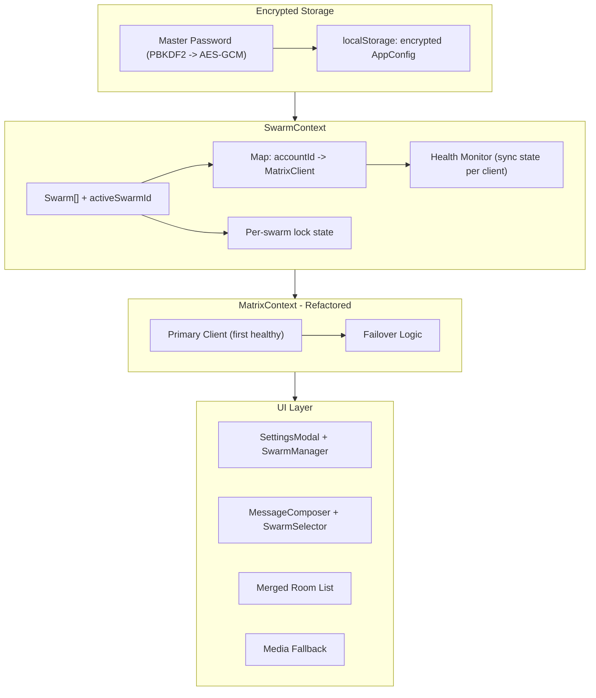

# Swarm Multi-Account Feature

## Architecture Overview




## Data Model

New types in `[src/lib/types.ts](src/lib/types.ts)`:

```typescript
interface SwarmAccount {
  id: string;
  baseUrl: string;
  userId: string;
  accessToken: string;
  deviceId: string;
}

interface Swarm {
  id: string;
  name: string;
  accounts: SwarmAccount[];
  passwordHint?: string;
  lockSalt?: string;        // base64, optional (only when swarm password is configured)
  lockVerifier?: string;    // base64 verifier encrypted/hash to validate unlock password
}

interface SwarmConfig {
  swarms: Swarm[];
  activeSwarmId: string;
}

interface AppPreferences {
  theme: "light" | "dark";
  hideMedia: boolean;
  sendMarkdown: boolean;
  sendReadReceipts: boolean;
  playlistImageDuration: number;
  playlistShowMessages: boolean;
  playlistMessageDuration: number;
  swarmFailoverTimeout: number;
  swarmSecondarySyncIntervalMinutes: number;  // 1–5, slow sync for non-primary accounts
  swarmMissedEventsThreshold: number;        // default 3; above this, switch to frequent sync
}

interface AppConfig {
  swarmConfig: SwarmConfig;
  preferences: AppPreferences;
}

interface EncryptedSwarmExport {
  version: 1;
  salt: string;       // base64
  iv: string;         // base64
  ciphertext: string; // base64, AES-GCM encrypted payload
  payloadType: "appConfig" | "swarmConfig";
}
```

The existing `SessionData` type is replaced by `SwarmAccount`. Passwords are only stored in exports/imports (encrypted), not plaintext in localStorage. In localStorage, account access tokens are stored in structured `AppConfig`, and swarm lock state is runtime-only (not persisted as plaintext unlock tokens).

---

## Phase 1: Encrypted Storage and Crypto Utilities

**New file: `src/lib/swarmCrypto.ts`**

- `deriveKey(password: string, salt: Uint8Array): Promise<CryptoKey>` -- PBKDF2, 100k iterations, SHA-256
- `encrypt(data: string, password: string): Promise<EncryptedSwarmExport>` -- AES-GCM
- `decrypt(blob: EncryptedSwarmExport, password: string): Promise<string>` -- AES-GCM
- `exportAppConfig(config: AppConfigWithPasswords, masterPassword: string): Promise<EncryptedSwarmExport>`
- `importAppConfig(blob: EncryptedSwarmExport, masterPassword: string): Promise<AppConfigWithPasswords>`
- `exportSwarmConfig(config: SwarmConfigWithPasswords, masterPassword: string): Promise<EncryptedSwarmExport>` (bespoke swarm-only export)
- `importSwarmConfig(blob: EncryptedSwarmExport, masterPassword: string): Promise<SwarmConfigWithPasswords>` (bespoke swarm-only import)
- `createSwarmLockVerifier(password: string): Promise<{ lockSalt: string; lockVerifier: string }>`
- `verifySwarmLockPassword(password: string, lockSalt: string, lockVerifier: string): Promise<boolean>`

All crypto uses the Web Crypto API (no external dependencies).

---

## Phase 2: Swarm Session Management

**Modified: `[src/lib/session.ts](src/lib/session.ts)`**

Replace single-session storage with multi-swarm storage:

- `saveAppConfig(config: AppConfig): void` -- saves to `localStorage` under `app_config`
- `loadAppConfig(): AppConfig | null`
- `clearAppConfig(): void`
- Keep helper mappers for legacy settings keys in `SettingsContext` and migrate into `preferences`
- Backward compatibility: if old `matrix_session` key exists, migrate it to a default swarm on first load

---

## Phase 3: SwarmContext

**New file: `src/contexts/SwarmContext.tsx`**

Core state manager for all swarm operations:

- **State:** `swarms: Swarm[]`, `activeSwarmId: string`, `clients: Map<string, MatrixClient>`, `clientHealth: Map<string, "healthy" | "syncing" | "error">`, `unlockedSwarms: Set<string>`
- **Actions:**
  - `addSwarm(name: string): Swarm`
  - `removeSwarm(swarmId: string): void`
  - `renameSwarm(swarmId: string, name: string): void`
  - `setActiveSwarm(swarmId: string): void`
  - `setSwarmPassword(swarmId: string, password: string, hint?: string): Promise<void>`
  - `clearSwarmPassword(swarmId: string): void`
  - `unlockSwarm(swarmId: string, password: string): Promise<boolean>`
  - `lockSwarm(swarmId: string): void`
  - `isSwarmUnlocked(swarmId: string): boolean`
  - `addAccount(swarmId: string, baseUrl: string, user: string, password: string): Promise<void>` -- logs in, creates MatrixClient, starts sync
  - `removeAccount(swarmId: string, accountId: string): void`
  - `getHealthyClients(swarmId?: string): MatrixClient[]` -- returns all healthy clients for a swarm
  - `getPrimaryClient(): MatrixClient | null` -- first healthy client of active swarm
- **Initialization:** On mount, loads `AppConfig` from localStorage, initializes all MatrixClients for unlocked swarms, starts syncing those clients. When creating each client, use the swarm’s shared recovery key for crypto callbacks so all accounts in a swarm use the same recovery key (see Phase 12).
- **Health monitoring:** Listens to `ClientEvent.Sync` on each client, updates health map
- **Adaptive sync for non-primary accounts:** To avoid spamming servers, secondary accounts in a swarm (i.e. not the primary client) use a reduced sync cadence:
  - Primary client: normal sync (SDK default / full frequency).
  - Non-primary clients: sync on a slow interval (configurable 1–5 minutes). On each slow sync, check for missed events. **Session-aware prioritization:** track the set of rooms the user has visited this session (e.g. whenever `currentRoomId` is set, add it to `sessionVisitedRoomIds`). When evaluating whether to switch to frequent sync, count only (or weight heavily) missed events in those visited rooms toward `swarmMissedEventsThreshold`. Missed events in rooms the user has not opened this session matter less and do not trigger frequent sync by default. Implement in `src/lib/swarmSyncScheduler.ts`; scheduler receives the current visited-room set (or getter) from context so it can compute "missed events in visited rooms" vs elsewhere.
- **Lock behavior:** Locked swarms do not expose clients/rooms/media until unlocked; users can re-lock at any time from settings. Locked swarms do not call sync. Rooms of locked swarms should not be visible to the user, until the swarm is unlocked. Relocking the room, hides all rooms where this is the only swarm in said room.

Wraps `MatrixProvider` in `[src/main.tsx](src/main.tsx)`:

```
SwarmProvider > MatrixProvider > App
```

---

## Phase 4: Refactor MatrixContext

**Modified: `[src/contexts/MatrixContext.tsx](src/contexts/MatrixContext.tsx)`**

Major refactor -- instead of creating its own client, it delegates to `SwarmContext`:

- `client` now comes from `swarmContext.getPrimaryClient()`
- `login()` is rewritten: calls `swarmContext.addAccount()` on the active swarm (or creates a default swarm first)
- `logout()` clears all clients and the swarm config
- `initFromSession()` replaced by swarm initialization in `SwarmContext`
- All existing context values (`currentRoomId`, `lightboxTarget`, `playlistTarget`, etc.) remain unchanged
- Add new context values:
  - `activeSwarm: Swarm | null`
  - `allSwarmClients: MatrixClient[]` (all healthy clients in active swarm)
  - `isActiveSwarmUnlocked: boolean`
  - `sendingSwarmId: string | null` -- when multiple swarms are in a room, which one to send as
  - `setSendingSwarmId(id: string | null): void`
  - `sessionVisitedRoomIds: Set<string>` -- room IDs the user has opened this session (updated when `setCurrentRoomId` is called); used by adaptive sync to prioritize missed events in visited rooms

---

## Phase 5: Merged Room List

**Modified: `[src/hooks/useRoomList.ts](src/hooks/useRoomList.ts)`**

- Instead of `client.getRooms()`, iterate all clients in active swarm
- Merge rooms by `roomId` -- if multiple clients are in the same room, treat as one entry
- Track `roomClientMap: Map<roomId, MatrixClient[]>` -- which clients can access which rooms
- Expose `getClientsForRoom(roomId: string): MatrixClient[]`

**Modified: `[src/hooks/useFavourites.ts](src/hooks/useFavourites.ts)`**

- Same merging logic for favourites rooms
- Favourites rooms are per-swarm (only rooms from active swarm's clients)

If users are allowed to invite other accounts, add a "Synchronise swarm" button to the settings dropdown of a room, assuming not all swarm accounts are in this room (should never happen anyway unless other matrix clients are used to join rooms at times). This would invite all other swarm accounts to the room.

---

## Phase 6: Message Sending with Failover

**Modified: `[src/components/MessageComposer.tsx](src/components/MessageComposer.tsx)`**

New `sendWithFailover()` function:

```
1. Get ordered list of healthy clients for active swarm that are members of the room
2. Try sending from primary client with a timeout (configurable, default 5s)
3. If timeout expires: abort (where possible), try next client
4. If all fail: show error
5. Track which client succeeded for "preferred sender" hinting (ask user if they want to set this as the new primary client)
```

**New settings in `[src/contexts/SettingsContext.tsx](src/contexts/SettingsContext.tsx)`:**

- `swarmFailoverTimeout: number` (default: 5, in seconds)
- `setSwarmFailoverTimeout(s: number): void`
- `swarmSecondarySyncIntervalMinutes: number` (default: 5) — slow sync interval for non-primary swarm accounts
- `setSwarmSecondarySyncIntervalMinutes(m: number): void`
- `swarmMissedEventsThreshold: number` (default: 3) — above this many missed events, a secondary account switches to frequent sync until caught up
- `setSwarmMissedEventsThreshold(n: number): void`

---

## Phase 7: Room Joining with All Swarm Accounts

When the user joins a room (via invite accept or explicit join), join with all accounts in the active swarm:

- Primary client joins immediately
- Other clients join with staggered delays (500ms apart) to avoid rate limiting
- Background process, non-blocking to the user
- If a secondary account fails to join, log a warning but don't alert the user

This logic lives in a new helper: `src/lib/swarmRoomJoin.ts`

It's possible in some cases the rooms will not be able to join. In these scenarios a simple notification to the user indicating that other swarm members can't join, and they need to seek permissions directly should suffice.

---

## Phase 8: Media Fallback

**Modified: `[src/lib/media.ts](src/lib/media.ts)`**

- `fetchMedia()` and `fetchAuthenticatedMedia()` gain an optional `fallbackClients: MatrixClient[]` parameter
- If the primary client returns 404 or fails, try the next client in the list
- Tries are sequential (not parallel) to avoid bombarding servers
- Cache is keyed by `mxcUrl + clientUserId` to avoid false cache hits across clients

**Modified: `[src/components/Message.tsx](src/components/Message.tsx)`**

- `ImageContent` and `VideoContent` pass `allSwarmClients` from context to `fetchMedia()`

---

## Phase 9: Swarm Selector in Chat Bar

**New file: `src/components/SwarmSelector.tsx`**

A small dropdown next to the message composer that appears only when multiple swarms have accounts joined to the current room:

- Shows active swarm name with a small dropdown arrow
- On click, shows list of swarms that are in this room
- Selecting a swarm sets `sendingSwarmId` in context
- This swarm's clients are used for sending messages in this room

**Modified: `[src/components/ChatArea.tsx](src/components/ChatArea.tsx)`**

- Render `<SwarmSelector />` next to `<MessageComposer />` when applicable

---

## Phase 10: Settings UI -- Swarm Manager

**New file: `src/components/SwarmManager.tsx`**

Rendered inside `[src/components/SettingsModal.tsx](src/components/SettingsModal.tsx)` as the first section. Matches the mockup design:

- Each swarm is a bordered card with:
  - Radio button to select active swarm (circle on the left)
  - Editable name field (colored, inline-editable)
  - Table of accounts: User | Server | Pass (masked with dots)
  - "+ Add Account" button (green) -- opens inline form for server/user/password
  - Delete account button per row
  - Optional "Set/Change Swarm Password" action with password hint
  - "Lock swarm" / "Unlock swarm" controls
- "+ Add Swarm" button (magenta) at the bottom
- Export buttons:
  - "Export All Config" (encrypted JSON with swarms + all preferences)
  - "Export Swarm Only" (encrypted JSON with just swarms/accounts)
- Failover timeout, secondary sync interval (1–5 min), and missed-events threshold settings

**Modified: `[src/components/SettingsModal.tsx](src/components/SettingsModal.tsx)`**

- Import and render `<SwarmManager />` as the first section, before "Appearance"
- Logout button logic changes: logs out all accounts in all swarms

---

## Phase 11: Import/Export on Login Screen

**Modified: `[src/components/LoginScreen.tsx](src/components/LoginScreen.tsx)`**

Add below the login form:

- "Import Config" button -- file picker for JSON (`payloadType` determines app vs swarm)
- Prompts for master password
- Decrypts file and:
  - if `appConfig`, restores swarms + all preferences (theme/messages/playlist/failover/etc.)
  - if `swarmConfig`, restores only swarms/accounts
- Logs in relevant accounts and saves config

Also keep login screen default flow where first successful login creates default swarm.

Export actions remain in SettingsModal (Phase 10).

---

## Phase 11B: Optional Swarm Password Locks

**Modified: `[src/components/SwarmManager.tsx](src/components/SwarmManager.tsx)` and `[src/contexts/SwarmContext.tsx](src/contexts/SwarmContext.tsx)`**

- Each swarm can optionally have a second password (in addition to master password)
- Password is not stored in plaintext; the 2nd password stores the other swarm credentials in another layer of encryption. Locking a swarm should re-encrypt the credentials. Unlocking prompts password which is to be used to decrypt the encrypted credentials and login.
- After app startup + master unlock, swarms with lock passwords remain locked until explicitly unlocked
- Locked swarm behavior:
  - rooms/messages/media from that swarm are hidden
  - sending via that swarm is disabled
  - settings show lock badge and unlock prompt
- Re-lock action immediately clears that swarm's in-memory clients/keys and removes it from merged room/media/send candidates

---

## Phase 12: E2EE Key Sharing Between Swarm Accounts

**Requirement: all swarm clients use the same recovery key.** Within a swarm, every account should use one shared recovery key for secret storage / key backup. That way backups and restores are consistent across accounts and the user only manages one recovery key per swarm.

**New file: `src/lib/swarmKeySharing.ts`** (and wiring in SwarmContext / MatrixContext crypto callbacks)

- When the user sets or submits a recovery key for any account in a swarm, propagate that same recovery key to all other accounts in that swarm (set as secret storage key and enable key backup using the same key on each client).
- When adding a new account to a swarm, if the swarm already has a recovery key configured (e.g. stored in memory or derived from the first account’s secret storage), configure the new account’s crypto with that same recovery key during init.
- Optionally, in addition to the shared recovery key:
  1. Pick the account with the most room keys (or the one with recovery key set up).
  2. Export room keys from that account via `client.getCrypto().exportRoomKeys()`.
  3. Import those keys into all other accounts via `client.getCrypto().importRoomKeys()`.
  4. Run this on-demand (e.g. when a new account is added) or periodically as best-effort.
- Best-effort: if an account can’t decrypt, another in the swarm can; recovery key setup failures on one account should not block others.

---

## Migration Strategy

For existing users with a single `matrix_session` in localStorage:

- On first load with new code, detect old `matrix_session` key
- Auto-create a default swarm named "My Swarm" containing that single account
- Save as new `app_config` format (with migrated preferences defaults)
- Remove old `matrix_session` key

---

## Key Files Summary

- `src/lib/types.ts` -- New Swarm/SwarmAccount/SwarmConfig/AppConfig types
- `src/lib/swarmCrypto.ts` -- **New** -- AES-GCM encryption/decryption utilities
- `src/lib/swarmRoomJoin.ts` -- **New** -- Staggered room join logic
- `src/lib/swarmSyncScheduler.ts` -- **New** -- Adaptive sync for non-primary swarm accounts (slow interval; missed-events count uses session-visited rooms only; switch to frequent when over threshold)
- `src/lib/swarmKeySharing.ts` -- **New** -- Same recovery key for all swarm accounts; optional room-key export/import
- `src/lib/session.ts` -- Rewritten for app config storage + migration
- `src/lib/media.ts` -- Add fallback client support
- `src/contexts/SwarmContext.tsx` -- **New** -- Core swarm state management
- `src/contexts/MatrixContext.tsx` -- Major refactor to delegate to SwarmContext
- `src/contexts/SettingsContext.tsx` -- Add failover timeout, secondary sync interval, and missed-events threshold settings
- `src/components/SwarmManager.tsx` -- **New** -- Settings UI for swarm management
- `src/components/SwarmSelector.tsx` -- **New** -- Chat bar swarm picker
- `src/components/SettingsModal.tsx` -- Add SwarmManager section
- `src/components/LoginScreen.tsx` -- Add import config option
- `src/components/MessageComposer.tsx` -- Add failover sending logic
- `src/components/ChatArea.tsx` -- Add SwarmSelector rendering
- `src/components/Message.tsx` -- Pass fallback clients for media
- `src/hooks/useRoomList.ts` -- Merge rooms from all swarm clients
- `src/hooks/useFavourites.ts` -- Swarm-aware favourites
- `src/main.tsx` -- Add SwarmProvider wrapper

