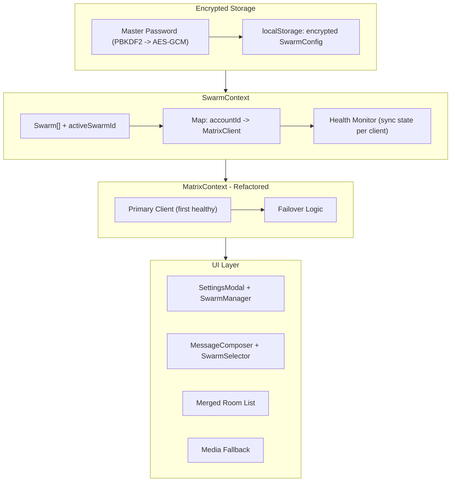

# Swarm Multi-Account Feature

## Architecture Overview




## Data Model

New types in `[src/lib/types.ts](src/lib/types.ts)`:

```typescript
interface SwarmAccount {
  id: string;
  baseUrl: string;
  userId: string;
  accessToken: string;
  deviceId: string;
}

interface Swarm {
  id: string;
  name: string;
  accounts: SwarmAccount[];
}

interface SwarmConfig {
  swarms: Swarm[];
  activeSwarmId: string;
}

interface EncryptedSwarmExport {
  version: 1;
  salt: string;       // base64
  iv: string;         // base64
  ciphertext: string; // base64, AES-GCM encrypted SwarmConfig + passwords
}
```

The existing `SessionData` type is replaced by `SwarmAccount`. Passwords are only stored in the export file (encrypted), not in localStorage. In localStorage, we store access tokens as today but structured as `SwarmConfig`.

---

## Phase 1: Encrypted Storage and Crypto Utilities

**New file: `src/lib/swarmCrypto.ts`**

- `deriveKey(password: string, salt: Uint8Array): Promise<CryptoKey>` -- PBKDF2, 100k iterations, SHA-256
- `encrypt(data: string, password: string): Promise<EncryptedSwarmExport>` -- AES-GCM
- `decrypt(blob: EncryptedSwarmExport, password: string): Promise<string>` -- AES-GCM
- `exportSwarmConfig(config: SwarmConfigWithPasswords, masterPassword: string): Promise<EncryptedSwarmExport>`
- `importSwarmConfig(blob: EncryptedSwarmExport, masterPassword: string): Promise<SwarmConfigWithPasswords>`

All crypto uses the Web Crypto API (no external dependencies).

---

## Phase 2: Swarm Session Management

**Modified: `[src/lib/session.ts](src/lib/session.ts)`**

Replace single-session storage with multi-swarm storage:

- `saveSwarmConfig(config: SwarmConfig): void` -- saves to `localStorage` under `swarm_config`
- `loadSwarmConfig(): SwarmConfig | null`
- `clearSwarmConfig(): void`
- Backward compatibility: if old `matrix_session` key exists, migrate it to a default swarm on first load

---

## Phase 3: SwarmContext

**New file: `src/contexts/SwarmContext.tsx`**

Core state manager for all swarm operations:

- **State:** `swarms: Swarm[]`, `activeSwarmId: string`, `clients: Map<string, MatrixClient>`, `clientHealth: Map<string, "healthy" | "syncing" | "error">`
- **Actions:**
  - `addSwarm(name: string): Swarm`
  - `removeSwarm(swarmId: string): void`
  - `renameSwarm(swarmId: string, name: string): void`
  - `setActiveSwarm(swarmId: string): void`
  - `addAccount(swarmId: string, baseUrl: string, user: string, password: string): Promise<void>` -- logs in, creates MatrixClient, starts sync
  - `removeAccount(swarmId: string, accountId: string): void`
  - `getHealthyClients(swarmId?: string): MatrixClient[]` -- returns all healthy clients for a swarm
  - `getPrimaryClient(): MatrixClient | null` -- first healthy client of active swarm
- **Initialization:** On mount, loads `SwarmConfig` from localStorage, initializes all MatrixClients, starts syncing all of them
- **Health monitoring:** Listens to `ClientEvent.Sync` on each client, updates health map

Wraps `MatrixProvider` in `[src/main.tsx](src/main.tsx)`:

```
SwarmProvider > MatrixProvider > App
```

---

## Phase 4: Refactor MatrixContext

**Modified: `[src/contexts/MatrixContext.tsx](src/contexts/MatrixContext.tsx)`**

Major refactor -- instead of creating its own client, it delegates to `SwarmContext`:

- `client` now comes from `swarmContext.getPrimaryClient()`
- `login()` is rewritten: calls `swarmContext.addAccount()` on the active swarm (or creates a default swarm first)
- `logout()` clears all clients and the swarm config
- `initFromSession()` replaced by swarm initialization in `SwarmContext`
- All existing context values (`currentRoomId`, `lightboxTarget`, `playlistTarget`, etc.) remain unchanged
- Add new context values:
  - `activeSwarm: Swarm | null`
  - `allSwarmClients: MatrixClient[]` (all healthy clients in active swarm)
  - `sendingSwarmId: string | null` -- when multiple swarms are in a room, which one to send as
  - `setSendingSwarmId(id: string | null): void`

---

## Phase 5: Merged Room List

**Modified: `[src/hooks/useRoomList.ts](src/hooks/useRoomList.ts)`**

- Instead of `client.getRooms()`, iterate all clients in active swarm
- Merge rooms by `roomId` -- if multiple clients are in the same room, treat as one entry
- Track `roomClientMap: Map<roomId, MatrixClient[]>` -- which clients can access which rooms
- Expose `getClientsForRoom(roomId: string): MatrixClient[]`

**Modified: `[src/hooks/useFavourites.ts](src/hooks/useFavourites.ts)`**

- Same merging logic for favourites rooms
- Favourites rooms are per-swarm (only rooms from active swarm's clients)

---

## Phase 6: Message Sending with Failover

**Modified: `[src/components/MessageComposer.tsx](src/components/MessageComposer.tsx)`**

New `sendWithFailover()` function:

```
1. Get ordered list of healthy clients for active swarm that are members of the room
2. Try sending from first client with a timeout (configurable, default 5s)
3. If timeout expires: abort (where possible), try next client
4. If all fail: show error
5. Track which client succeeded for "preferred sender" hinting
```

**New setting in `[src/contexts/SettingsContext.tsx](src/contexts/SettingsContext.tsx)`:**

- `swarmFailoverTimeout: number` (default: 5, in seconds)
- `setSwarmFailoverTimeout(s: number): void`

---

## Phase 7: Room Joining with All Swarm Accounts

When the user joins a room (via invite accept or explicit join), join with all accounts in the active swarm:

- Primary client joins immediately
- Other clients join with staggered delays (500ms apart) to avoid rate limiting
- Background process, non-blocking to the user
- If a secondary account fails to join, log a warning but don't alert the user

This logic lives in a new helper: `src/lib/swarmRoomJoin.ts`

---

## Phase 8: Media Fallback

**Modified: `[src/lib/media.ts](src/lib/media.ts)`**

- `fetchMedia()` and `fetchAuthenticatedMedia()` gain an optional `fallbackClients: MatrixClient[]` parameter
- If the primary client returns 404 or fails, try the next client in the list
- Tries are sequential (not parallel) to avoid bombarding servers
- Cache is keyed by `mxcUrl + clientUserId` to avoid false cache hits across clients

**Modified: `[src/components/Message.tsx](src/components/Message.tsx)`**

- `ImageContent` and `VideoContent` pass `allSwarmClients` from context to `fetchMedia()`

---

## Phase 9: Swarm Selector in Chat Bar

**New file: `src/components/SwarmSelector.tsx`**

A small dropdown next to the message composer that appears only when multiple swarms have accounts joined to the current room:

- Shows active swarm name with a small dropdown arrow
- On click, shows list of swarms that are in this room
- Selecting a swarm sets `sendingSwarmId` in context
- This swarm's clients are used for sending messages in this room

**Modified: `[src/components/ChatArea.tsx](src/components/ChatArea.tsx)`**

- Render `<SwarmSelector />` next to `<MessageComposer />` when applicable

---

## Phase 10: Settings UI -- Swarm Manager

**New file: `src/components/SwarmManager.tsx`**

Rendered inside `[src/components/SettingsModal.tsx](src/components/SettingsModal.tsx)` as the first section. Matches the mockup design:

- Each swarm is a bordered card with:
  - Radio button to select active swarm (circle on the left)
  - Editable name field (colored, inline-editable)
  - Table of accounts: User | Server | Pass (masked with dots)
  - "+ Add Account" button (green) -- opens inline form for server/user/password
  - Delete account button per row
- "+ Add Swarm" button (magenta) at the bottom
- Export button -- triggers encrypted JSON download
- Failover timeout setting

**Modified: `[src/components/SettingsModal.tsx](src/components/SettingsModal.tsx)`**

- Import and render `<SwarmManager />` as the first section, before "Appearance"
- Logout button logic changes: logs out all accounts in all swarms

---

## Phase 11: Import/Export on Login Screen

**Modified: `[src/components/LoginScreen.tsx](src/components/LoginScreen.tsx)`**

Add below the login form:

- "Import Swarm Config" button -- file picker for JSON
- Prompts for master password
- Decrypts the file, logs in all accounts, saves config

Export button is in SettingsModal (Phase 10).

---

## Phase 12: E2EE Key Sharing Between Swarm Accounts

**New file: `src/lib/swarmKeySharing.ts`**

After all accounts in a swarm are initialized:

1. Pick the account with the most room keys (or the one with recovery key set up)
2. Export room keys from that account via `client.getCrypto().exportRoomKeys()`
3. Import those keys into all other accounts via `client.getCrypto().importRoomKeys()`
4. Run this periodically or on-demand (e.g., when a new account is added to a swarm)
5. This is best-effort -- if an account can't decrypt, it's not critical since another can

---

## Migration Strategy

For existing users with a single `matrix_session` in localStorage:

- On first load with new code, detect old `matrix_session` key
- Auto-create a default swarm named "My Swarm" containing that single account
- Save as new `swarm_config` format
- Remove old `matrix_session` key

---

## Key Files Summary

- `src/lib/types.ts` -- New Swarm/SwarmAccount/SwarmConfig types
- `src/lib/swarmCrypto.ts` -- **New** -- AES-GCM encryption/decryption utilities
- `src/lib/swarmRoomJoin.ts` -- **New** -- Staggered room join logic
- `src/lib/swarmKeySharing.ts` -- **New** -- E2EE key export/import between accounts
- `src/lib/session.ts` -- Rewritten for multi-swarm storage + migration
- `src/lib/media.ts` -- Add fallback client support
- `src/contexts/SwarmContext.tsx` -- **New** -- Core swarm state management
- `src/contexts/MatrixContext.tsx` -- Major refactor to delegate to SwarmContext
- `src/contexts/SettingsContext.tsx` -- Add failover timeout setting
- `src/components/SwarmManager.tsx` -- **New** -- Settings UI for swarm management
- `src/components/SwarmSelector.tsx` -- **New** -- Chat bar swarm picker
- `src/components/SettingsModal.tsx` -- Add SwarmManager section
- `src/components/LoginScreen.tsx` -- Add import config option
- `src/components/MessageComposer.tsx` -- Add failover sending logic
- `src/components/ChatArea.tsx` -- Add SwarmSelector rendering
- `src/components/Message.tsx` -- Pass fallback clients for media
- `src/hooks/useRoomList.ts` -- Merge rooms from all swarm clients
- `src/hooks/useFavourites.ts` -- Swarm-aware favourites
- `src/main.tsx` -- Add SwarmProvider wrapper

